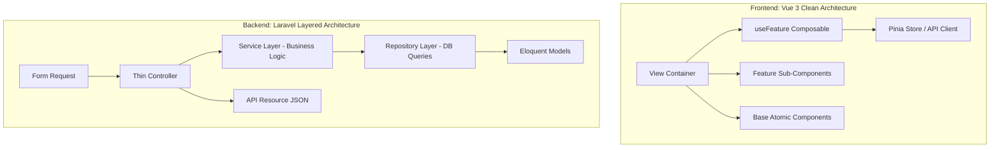

# 🏗️ KẾ HOẠCH TÁI CẤU TRÚC TOÀN DIỆN MÃ NGUỒN (REFACTORING ROADMAP)
## Dự án: CineReserve (Laravel 11 Backend & Vue 3 Frontend)

> **Mục tiêu:** Chuẩn hóa 100% kiến trúc dự án theo chuẩn Enterprise (Layered Architecture - Service/Repository Pattern cho Backend; Atomic Design + Custom Composables cho Frontend), loại bỏ Controller "béo" và SFC Vue quá dài.  
> **Trạng thái:** ✅ Đã hoàn thành 100% tất cả các hạng mục kiến trúc.

---

## 🔍 I. HIỆN TRẠNG & VẤN ĐỀ ĐÃ TỐI ƯU (TECHNICAL DEBT RESOLVED)

### 🐘 1. Tối Ưu Backend (Laravel 11, PHP 8.3):
| Thành phần | Hiện trạng cũ | Hướng giải quyết đã thực hiện |
| :--- | :--- | :--- |
| **Admin Controllers** | Controller đang trực tiếp viết câu lệnh Eloquent Query (`where()`, `orderBy()`, `paginate()`), tính toán doanh thu bằng `DB::raw()`, chạy `DB::transaction()` bên trong action method. | **Chuyển thành Thin Controller:** Controller chỉ nhận Form Request $\rightarrow$ Ủy quyền cho Service/Repository $\rightarrow$ Trả về API Resource. |
| **Business Logic** | Logic tạo suất chiếu hàng loạt (Batch multi-cinemas), tính toán doanh thu theo 4 chu kỳ thời gian đang nằm lẫn trong Controller. | Đã tách sang **`ShowtimeService`**, **`AnalyticsService`**, và **`AdminBookingService`** chuẩn SRP. |
| **Query Layer** | Các câu truy vấn eager loading quan hệ (`with(['movie', 'cinema', 'room'])`) bị lặp lại ở nhiều nơi. | Đã đóng gói trong **`ShowtimeRepository`**, **`AnalyticsRepository`**, **`BookingRepository`** và đăng ký DI qua Service Container. |

---

### 🎨 2. Tối Ưu Frontend (Vue 3, TypeScript, Pinia):
| Thành phần | Hiện trạng cũ | Hướng giải quyết đã thực hiện |
| :--- | :--- | :--- |
| **Kích thước File SFC** | `AdminShowtimesView.vue` (> 970 dòng) phình to, chứa cùng lúc mọi modal và form. | **Đã phân tách thành các Feature Sub-components** (`MovieShowtimeCard`, `MovieShowtimeDetailModal`, `ShowtimeCreateModal`, `ShowtimeSingleForm`, `ShowtimeBatchForm`, `ShowtimeEditModal`). |
| **Tách rời State & Logic** | Biến reactive, computed, API calls, debounce search nằm trực tiếp trong `<script setup>`. | Đã trích xuất toàn bộ logic ra **Custom Composables (`useAdminShowtimes.ts`, `useAdminMovies.ts`, `useAdminAnalytics.ts`)**. |
| **Seat Booking Modular** | Toàn bộ template ghế, vòm màn hình và thanh checkout dồn trong một file. | Đã tách thành **`SeatScreenArc.vue`**, **`SeatGridMap.vue`**, **`SeatLegendPills.vue`**, **`SeatBookingActionBar.vue`**. |

---

## 🎯 II. CHI TIẾT CÁC THÀNH PHẦN ĐÃ HOÀN THÀNH

---

### 🚀 GIAI ĐOẠN 1: REFACTOR BACKEND (CLEAN LAYERED ARCHITECTURE)

#### 1. Xây dựng Repository Layer (`app/Repositories/`):
- [x] **`ShowtimeRepositoryInterface` & `ShowtimeRepository`:**
  - `getPaginatedShowtimes(array $filters, int $perPage)`
  - `getShowtimesByMovieId(int $movieId)`
  - `create(array $attributes)`
  - `updateOrCreate(array $attributes, array $values)`
  - `update(int $id, array $attributes)`
  - `delete(int $id)`
- [x] **`AnalyticsRepositoryInterface` & `AnalyticsRepository`:**
  - `getRevenue(Carbon $startDate, Carbon $endDate, ?int $cinemaId, ?int $movieId)`
  - `getTicketsCount(Carbon $startDate, Carbon $endDate, ?int $cinemaId, ?int $movieId)`
  - `getRevenueTrend(string $period, Carbon $startDate, Carbon $endDate, int $daysCount, ?int $cinemaId, ?int $movieId)`
  - `getTopMovies(int $limit)`
  - `getCinemaDistribution(float $totalRevenue)`
- [x] **`BookingRepositoryInterface` & `BookingRepository`:**
  - `getFilteredBookings(array $filters, int $perPage)`
  - `findById(int $id, array $relations)`
  - `updateStatus(int $id, string $status, array $extraAttributes)`

#### 2. Xây dựng Service Layer (`app/Services/`):
- [x] **`ShowtimeService`:**
  - `generateBatchShowtimes(array $data): array`
  - `createSingleShowtime(array $data): Showtime`
  - `updateShowtime(int $id, array $data): Showtime`
  - `deleteShowtime(int $id): bool`
- [x] **`AnalyticsService`:**
  - `calculateDashboardOverview(array $filterParams): array`
- [x] **`AdminBookingService`:**
  - `getPaginatedBookings(array $filters, int $perPage)`
  - `checkInTicket(int $bookingId): Booking`
  - `cancelBooking(int $bookingId): Booking`

#### 3. Tối Giản Hóa Controllers (Thin Controllers):
- [x] Refactor `AdminShowtimeController.php` $\rightarrow$ Tối đa 5–10 dòng mỗi method (Chỉ gọi `ShowtimeService` và trả về `ShowtimeResource`).
- [x] Refactor `AdminAnalyticsController.php` $\rightarrow$ Tối đa 5 dòng mỗi method (Ủy quyền cho `AnalyticsService`).
- [x] Refactor `AdminBookingController.php` $\rightarrow$ Ủy quyền cho `AdminBookingService`.

---

### 🚀 GIAI ĐOẠN 2: REFACTOR FRONTEND (MODULAR & COMPOSABLE PATTERN)

#### 1. Trích xuất Composables (`frontend/src/composables/`):
- [x] **`useAdminShowtimes.ts`:**
  - Quản lý danh sách showtimes, pagination, movie status tabs, filter state.
  - Quản lý hàm gọi API `loadData()`, `handleDelete()`, `handleUpdateShowtime()`, `handleSubmitSingle()`, `handleSubmitBatch()`.
  - Quản lý tính toán tự động giá 3 loại ghế (Standard, VIP, Couple).
- [x] **`useAdminMovies.ts`:**
  - Quản lý CRUD phim, upload poster/trailer preview, form state.
- [x] **`useAdminAnalytics.ts`:**
  - Quản lý fetch metric 4 chu kỳ (Today, 7D, 30D, Year), xử lý format tiền tệ và dữ liệu biểu đồ.

#### 2. Phân Tách Sub-components Chuyên Biệt Cho `AdminShowtimesView.vue`:
- [x] `frontend/src/components/admin/showtimes/MovieShowtimeCard.vue`: Card hiển thị từng bộ phim, poster, số lượng suất chiếu và nhãn trạng thái.
- [x] `frontend/src/components/admin/showtimes/MovieShowtimeDetailModal.vue`: Modal xem danh sách mọi suất chiếu của phim trên toàn quốc.
- [x] `frontend/src/components/admin/showtimes/ShowtimeSingleForm.vue`: Form tạo 1 suất chiếu đơn lẻ.
- [x] `frontend/src/components/admin/showtimes/ShowtimeBatchForm.vue`: Form tạo hàng loạt cho nhiều rạp và nhiều khung giờ.
- [x] `frontend/src/components/admin/showtimes/ShowtimeCreateModal.vue`: Modal tạo suất chiếu (Single/Batch).
- [x] `frontend/src/components/admin/showtimes/ShowtimeEditModal.vue`: Modal chỉnh sửa suất chiếu và giá 3 loại ghế.

#### 3. Phân Tách Sub-components Cho `SeatSelectionView.vue`:
- [x] `frontend/src/components/booking/SeatScreenArc.vue`: Vòm màn hình cong phát sáng.
- [x] `frontend/src/components/booking/SeatGridMap.vue`: Ma trận ghế render theo hàng và cột.
- [x] `frontend/src/components/booking/SeatLegendPills.vue`: Chú thích 4 trạng thái ghế và phân loại ghế.
- [x] `frontend/src/components/booking/SeatBookingActionBar.vue`: Thanh bottom bar đếm ngược và nút thanh toán.

---

## 📋 III. CHECKLIST BẮT ĐẦU CHO PHIÊN LÀM VIỆC TIẾP THEO

1. [x] **Bước 1:** Tạo thư mục `app/Repositories` và `app/Services` trong Backend.
2. [x] **Bước 2:** Di chuyển toàn bộ Eloquent Queries từ `AdminShowtimeController`, `AdminAnalyticsController`, `AdminBookingController` sang Services/Repositories.
3. [x] **Bước 3:** Tạo thư mục `frontend/src/composables/` và `frontend/src/components/admin/showtimes/`, `frontend/src/components/booking/`.
4. [x] **Bước 4:** Trích xuất state và logic sang `useAdminShowtimes.ts`, `useAdminMovies.ts`, `useAdminAnalytics.ts`.
5. [x] **Bước 5:** Tách nhỏ các template modal và form trong `AdminShowtimesView.vue` và `SeatSelectionView.vue` thành các sub-components độc lập.
6. [x] **Bước 6:** Chạy `npm run build` và test toàn diện API routes để đảm bảo 0 lỗi hồi quy (Regression).
