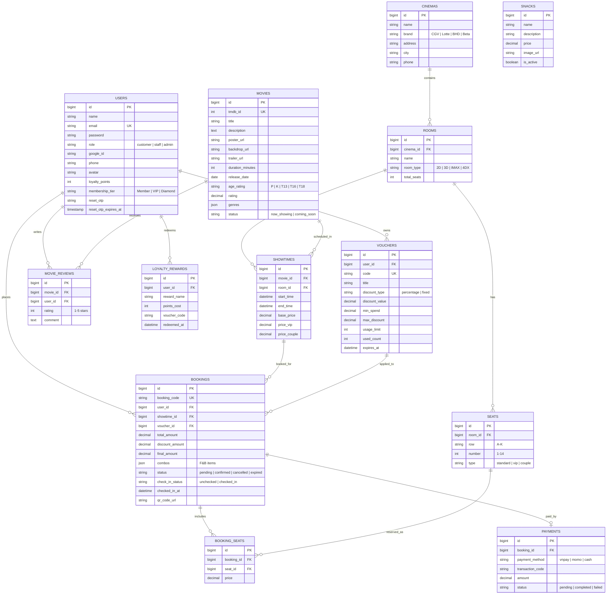
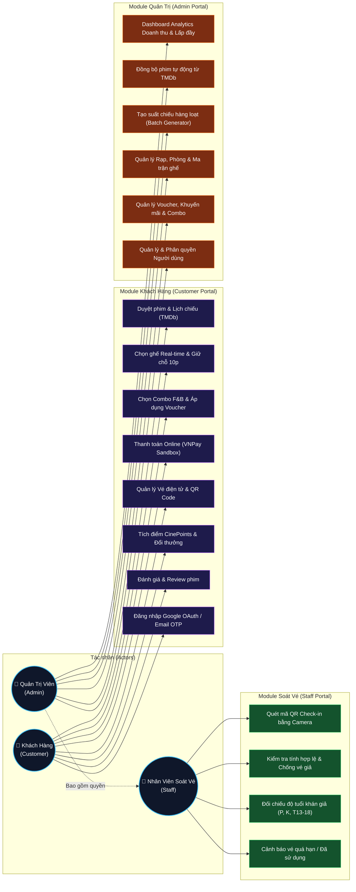
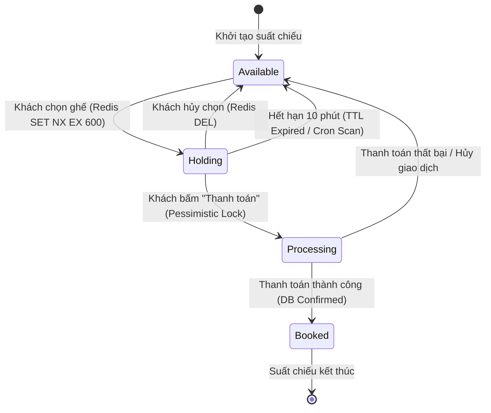
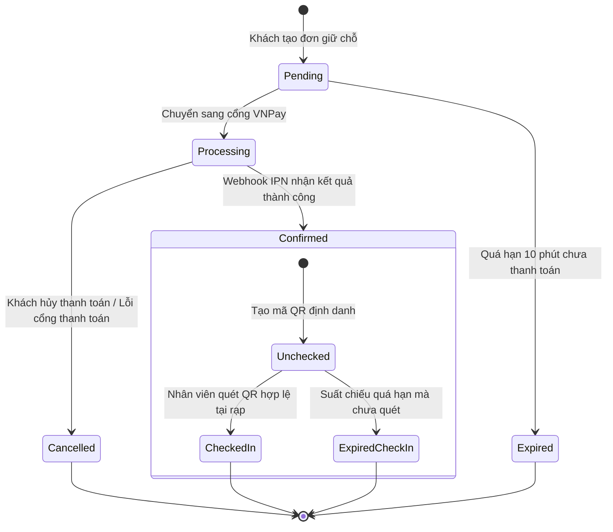

# 📊 Bộ Sơ Đồ Kiến Trúc & Thiết Kế Hệ Thống CineReserve

Tài liệu này tổng hợp toàn bộ các sơ đồ thiết kế kiến trúc, cơ sở dữ liệu, luồng nghiệp vụ thời gian thực và phân quyền chức năng của hệ thống **CineReserve**.

---

## 📑 Mục Lục
1. [Sơ Đồ Kiến Trúc Tổng Thể (System Architecture)](#1-sơ-đồ-kiến-trúc-tổng-thể-system-architecture)
2. [Sơ Đồ Cơ Sở Dữ Liệu Quan Hệ (Database ERD)](#2-sơ-đồ-cơ-sở-dữ-liệu-quan-hệ-database-erd)
3. [Sơ Đồ Tuần Tự Giữ Ghế & Thanh Toán 2-Phase Lock (Sequence Diagram)](#3-sơ-đồ-tuần-tự-giữ-ghế--thanh-toán-2-phase-lock-sequence-diagram)
4. [Sơ Đồ Phân Rã Chức Năng Theo Vai Trò (Use Case Diagram)](#4-sơ-đồ-phân-rã-chức-năng-theo-vai-trò-use-case-diagram)
5. [Sơ Đồ Vòng Đời Trạng Thái Ghế & Đơn Hàng (State Machine Diagram)](#5-sơ-đồ-vòng-đời-trạng-thái-ghế--đơn-hàng-state-machine-diagram)

---

## 1. Sơ Đồ Kiến Trúc Tổng Thể (System Architecture)

Sơ đồ mô tả các tầng kiến trúc (Client, Proxy, Application Service, Realtime WebSocket Server, Storage và External Services) được containerized thông qua Docker.

```mermaid
graph TB
    subgraph Clients["Tầng Khách Hàng & Thiết Bị (Client Tier)"]
        WebUser["Khách hàng (Vue 3 SPA Web)"]
        StaffApp["Nhân viên soát vé (Staff Scanner PWA)"]
        AdminApp["Quản trị viên (Admin Dashboard SPA)"]
    end

    subgraph Gateway["Tầng Cổng & Proxy (Gateway Tier)"]
        Nginx["Nginx Reverse Proxy & Load Balancer<br/>(Port: 80 / 443)"]
    end

    subgraph Backend["Tầng Xử Lý Nghiệp Vụ (Application Tier)"]
        Laravel["Laravel 11 RESTful API (PHP 8.3)<br/>• Service-Repository Pattern<br/>• Form Request Validation<br/>• API Resources"]
        Reverb["Laravel Reverb Server<br/>(WebSocket Engine: Port 8080)"]
        QueueWorker["Laravel Queue Worker<br/>• Gửi Email Vé / OTP<br/>• Quét hết hạn ghế TTL"]
    end

    subgraph DataTier["Tầng Lưu Trữ & Cache (Data Tier)"]
        Redis[("Redis 7.0<br/>• Distributed Lock (SET NX EX 600)<br/>• Session Cache & Job Queues<br/>• Pub/Sub Broadcasting")]
        MySQL[("MySQL 8.0 Database<br/>• Pessimistic Lock (SELECT FOR UPDATE)<br/>• ACID Transactions<br/>• Relational Data")]
    end

    subgraph External["Dịch Vụ Bên Thứ Ba (External Integrations)"]
        TMDB["TMDb API<br/>(Đồng bộ thông tin phim)"]
        VNPay["Cổng Thanh Toán VNPay / MoMo<br/>(Payment Gateway Sandbox)"]
        GoogleOAuth["Google Cloud OAuth 2.0<br/>(Single Sign-On)"]
        SMTP["Google SMTP Server<br/>(Email OTP & E-Ticket)"]
    end

    %% Client traffic
    WebUser -->|HTTP / REST API| Nginx
    StaffApp -->|HTTP / REST API| Nginx
    AdminApp -->|HTTP / REST API| Nginx
    
    WebUser <-->|WSS WebSocket Channels| Reverb
    StaffApp <-->|WSS WebSocket Channels| Reverb

    %% Gateway to Backend
    Nginx -->|Proxy Pass API Requests| Laravel
    Nginx -->|Proxy WebSocket Traffic| Reverb

    %% Backend internal connections
    Laravel -->|Broadcast Events| Reverb
    Laravel <-->|Distributed Lock & Cache| Redis
    Laravel <-->|Query & ACID Transactions| MySQL
    QueueWorker <-->|Pop Jobs| Redis
    QueueWorker -->|Update Status| MySQL

    %% External Connections
    Laravel -->|Fetch Movies / Sync| TMDB
    Laravel -->|Init Payment Request| VNPay
    VNPay -->|IPN Webhook Callback| Laravel
    Laravel -->|OAuth Verify Token| GoogleOAuth
    QueueWorker -->|Send Mail Tickets & OTP| SMTP

    classDef client fill:#1e293b,stroke:#38bdf8,stroke-width:2px,color:#f8fafc;
    classDef gateway fill:#0f172a,stroke:#818cf8,stroke-width:2px,color:#f8fafc;
    classDef backend fill:#1e1b4b,stroke:#a855f7,stroke-width:2px,color:#f8fafc;
    classDef data fill:#14532d,stroke:#22c55e,stroke-width:2px,color:#f8fafc;
    classDef ext fill:#7c2d12,stroke:#f97316,stroke-width:2px,color:#f8fafc;

    class WebUser,StaffApp,AdminApp client;
    class Nginx gateway;
    class Laravel,Reverb,QueueWorker backend;
    class Redis,MySQL data;
    class TMDB,VNPay,GoogleOAuth,SMTP ext;
```

---

## 2. Sơ Đồ Cơ Sở Dữ Liệu Quan Hệ (Database ERD)

Sơ đồ quan hệ thực thể mô tả các bảng, khóa chính (PK), khóa ngoại (FK) và mối quan hệ giữa các thực thể cốt lõi trong hệ thống.

---

## 3. Sơ Đồ Tuần Tự Giữ Ghế & Thanh Toán 2-Phase Lock (Sequence Diagram)

Sơ đồ luồng chi tiết xử lý bài toán **Race Condition & Giữ ghế 2 lớp** (Lớp 1: Redis Lock RAM, Lớp 2: DB Pessimistic Lock `FOR UPDATE`) và cập nhật thời gian thực qua **Laravel Reverb**.

```mermaid
sequenceDiagram
    autonumber
    actor Customer1 as Khách Hàng A
    actor Customer2 as Khách Hàng B
    participant VueApp as Vue 3 Client A
    participant VueAppB as Vue 3 Client B
    participant API as Laravel Backend
    participant Redis as Redis Cache (Lock Layer 1)
    participant Reverb as Laravel Reverb (WebSocket)
    participant MySQL as MySQL DB (Lock Layer 2)
    participant VNPay as VNPay Payment Gateway

    Note over Customer1,Reverb: GIAI ĐOẠN 1: GIỮ GHẾ TẠM THỜI (RAM LOCK - 10 PHÚT)
    Customer1->>VueApp: Click chọn Ghế (Vd: E-05)
    VueApp->>API: POST /api/showtimes/{id}/hold-seat {seat_ids: [101]}
    
    API->>Redis: SET lock:showtime:{id}:seat:101 {session_id} NX EX 600
    alt Redis Key đã tồn tại (Ghế đã bị người khác chọn)
        Redis-->>API: 0 (Lock Failed)
        API-->>VueApp: 409 Conflict ("Ghế đã được giữ bởi người khác")
        VueApp-->>Customer1: Hiển thị thông báo ghế không khả dụng
    else Redis Key tạo thành công (RAM Lock Acquired)
        Redis-->>API: 1 (OK)
        API->>Reverb: Broadcast event: SeatStatusUpdated(showtime_id, seat_id, 'holding')
        par Phát sự kiện Real-time
            Reverb-->>VueApp: Channel showtime.{id} -> Cập nhật ghế E-05 thành "Đang giữ"
            Reverb-->>VueAppB: Channel showtime.{id} -> Đổi màu ghế E-05 sang màu Vàng (Holding)
        end
        API-->>VueApp: 200 OK {success: true, held_until: timestamp}
        VueApp->>Customer1: Bật đồng hồ đếm ngược 10:00 giữ ghế
    end

    Note over Customer2,API: Khách B cố tình bấm chọn cùng ghế E-05
    Customer2->>VueAppB: Click chọn Ghế E-05
    VueAppB->>API: POST /api/showtimes/{id}/hold-seat {seat_ids: [101]}
    API->>Redis: SET lock:showtime:{id}:seat:101 {session_B} NX EX 600
    Redis-->>API: 0 (Bị chặn ngay tại RAM trong ~1ms)
    API-->>VueAppB: 409 Conflict ("Ghế đã có người giữ")
    VueAppB-->>Customer2: Thông báo lỗi tức thì (Không chạm vào MySQL)

    Note over Customer1,VNPay: GIAI ĐOẠN 2: THANH TOÁN & PESSIMISTIC LOCK (LOCK LAYER 2)
    Customer1->>VueApp: Chọn F&B, áp dụng Voucher & Click "Thanh Toán"
    VueApp->>API: POST /api/bookings/checkout
    
    rect rgb(30, 27, 75)
        Note over API,MySQL: Bắt đầu Transaction Database & Pessimistic Lock
        API->>MySQL: START TRANSACTION;
        API->>MySQL: SELECT * FROM showtime_seats WHERE showtime_id = ? AND seat_id = 101 FOR UPDATE;
        API->>MySQL: INSERT INTO bookings (status: 'pending')
        API->>MySQL: COMMIT;
    end

    API->>VNPay: Tạo URL thanh toán VNPay Sandbox
    API-->>VueApp: Return payment_url
    VueApp->>VNPay: Điều hướng khách sang cổng thanh toán VNPay
    Customer1->>VNPay: Nhập OTP thẻ / Xác nhận thanh toán

    Note over VNPay,MySQL: GIAI ĐOẠN 3: XÁC NHẬN ĐƠN & BROADCAST VÉ ĐÃ BÁN
    VNPay->>API: Webhook IPN (Mã giao dịch, Trạng thái: 00 Success)
    rect rgb(20, 83, 45)
        API->>MySQL: START TRANSACTION;
        API->>MySQL: Cập nhật booking.status = 'confirmed', tạo payment record
        API->>MySQL: Cập nhật điểm thưởng CinePoints & Hạng thành viên
        API->>MySQL: COMMIT;
        API->>Redis: Xóa Distributed Lock (DEL lock:showtime:{id}:seat:101)
    end

    API->>Reverb: Broadcast event: SeatStatusUpdated(showtime_id, seat_id, 'booked')
    par Cập nhật trạng thái vĩnh viễn
        Reverb-->>VueApp: Đổi màu ghế E-05 thành Đỏ (Booked)
        Reverb-->>VueAppB: Đổi màu ghế E-05 thành Đỏ (Booked)
    end
    API->>API: Dispatch Job: Gửi Email Vé Điện Tử kèm QR Code
    API-->>VNPay: Return 200 {RspCode: "00", Message: "Confirm Success"}
    Customer1->>VueApp: Được redirect về trang "Vé Của Tôi" (Hiển thị QR Check-in)
```

---

## 4. Sơ Đồ Phân Rã Chức Năng Theo Vai Trò (Use Case Diagram)

Phân quyền người dùng trong hệ thống thành 3 nhóm quyền chính: **Customer**, **Staff**, và **Admin**.

---

## 5. Sơ Đồ Vòng Đời Trạng Thái Ghế & Đơn Hàng (State Machine Diagram)

### 5.1. Vòng Đời Trạng Thái Ghế (Seat Lifecycle)

### 5.2. Vòng Đời Đơn Đặt Vé & Check-in (Booking & Ticket Lifecycle)

